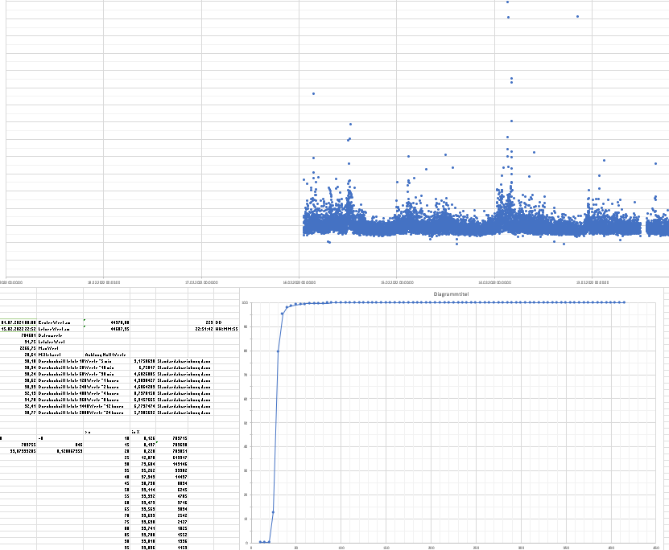

# Container `docker-jpwshd-debian`

## tldr : Quickstart

### Clone repo

1) cd into your development directory
2) `git clone git@github.com:jwesemann/docker-jpwshd.git`
3) `cd docker-jpwshd`

### Build docker image `weseit/pwshd`
1) `cd devdir/`
2) Look into Dockerfile (`amd64`) or Dockerfile-armv8 (`armv8`) and update the URL of the wget-command to point to the latest powershell package available.
3) Start the build script for your current architecture, e.g. `./dobuild.sh` for `amd64`
4) Check output and resulting image: `docker image ls` shoud give you one line containing `weseit/pwshd`

### Run container with persistent data-directories
1) `./run.sh`
2) `ctrl-c` to interrupt the tail -f
3) `./log.sh` to show container log output. Or use your vaforite management tool.

### Data location
* All my docker containers use a directory `datadir/` as a base config directory. 
* This container uses `datadir/workdir/` which is mounted at runtime into the container as `/root/workdir/`
* Running script can be found in `datadir/workdir/JMonitor.ps1`
* Datafile with recorded ping-values is located @ `datadir/workdir/JMonitor.csv`

## Overview

This small framework can be used to start (looping) Powershell-Scripts in a well defined unix server environment acting as "server daemons".

It uses a debian Docker-image from Microsoft Powershell team with additional German locales to start a script (default or configured by environment variable). Please visit <https://hub.docker.com/_/microsoft-powershell> for more information about these Docker-images.

To make this implementation run on ARM devices like the Raspberyy PI-4 (my development environment) I added 2nd Dockerfile-armv8 which is not dependent on the Microsoft Docker image anymore but only on the official Debian image `debian:latest`. It will install powershell into /root/powershell and run /root/powershell/pwsh . Please visit <https://hub.docker.com/_/debian> to get more information on the used Debian image.

The included script `JMonitor.ps1` periodically pings (ICMP request) a well defined webserver and writes the times needed into a CSV-file. Any pre-existing files will be reused (not overwritten) and the output data will be appended to the CSV-file.

In general this `Dockerfile` and the underlying simple scripts should run in several environments : Windows 10/11 native, Windows 10/11 WSL Ubuntu 20.04, Synology DSM718+, Kali-Linux native . I plan to extend this to be an multi-architecture docker image for my Raspberry 3/4 but need some learning how to achieve this.

## Startup-Hook

The startup-hook is an implicite one. A standard Powershell profile `Microsoft.PowerShell_profile.ps1` will be copied into the default directory `/home/root/.config/powershell` during image-building based on the Dockerfile).

It checks environment variable `PWSHSCRIPTFILE` and directory `/root/workdir` which should be mounted into the container from the docker host to decide which specific Powershell-script will be started as the main looping script. 

The shell-code within this script makes sure that the main functional loop will **only be started if no other instance** of a `pwsh`-process is already running within its container. This behavior makes it possible to attach an interactive terminal using powershell as its shell into the running conatiner for debugging purposes.

## Files in `devdir`

* `Dockerfile` : Create image script for `amd64`based machines 
* `dobuild.sh` : Starts the docker build sequence based on `debian:stable-slim` for `amd64` based machines.
* `Dockerfile_armv8` : based on Debians docker image. Will add Powershell with own install routines. So no dependency on Microsoft docker repo anymore.
* `dobuild-armv8.sh` : Starts the docker build sequence based on `debian:stable-slim` for  `armv8`based machines.
* `Microsoft.PowerShell_profile.ps1` : Powershell autostart-script containing the main startup-logic. Needs to be placed in `/root/.config/powershell`to start automatically.
* `JStandard.ps1` : small Powershell-script which will be copied from the image into workdir and being started if no valid combination to run from the environment-variable and directory-content is found. Will just show a short info message and exit. If this script is being used the container-restart-policy should be set to `--restart=on-failure:3` to avoid endless restart tries.
* `JMonitor.ps1` : The initial payload-script I wrote for my client PC to monitor ICMP-performance of my internet connection. It is based on a much older NT-CMD version. Target of this project was to make this functionality  available in docker on my different servers (Synology NAS 718+, Raspberry Pi, Windows) to run 24/7/365 independently from my client workstation. I already collected > 1 million data points giving me an interesting overview over the behavior and quality of the internet line and the reliability of my internal network (router / NAS downtimes)
* Currently missing in this repo: My private reporting MS-Excel sheet using the CSV as a database input and showing the graphical output. I plan to use the CSV to learn about Grafana/InfluxDB later if I find some time. But for now Excel does the job. A demo output can be found at this screenshoot .
